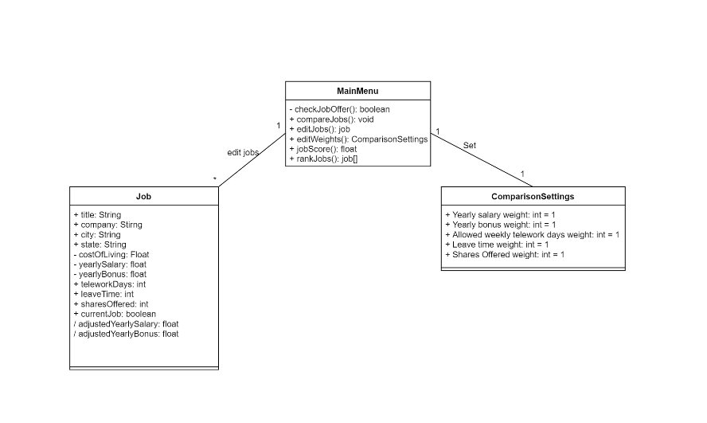
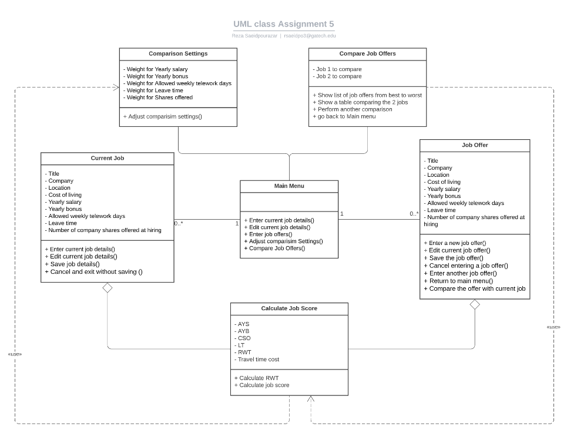
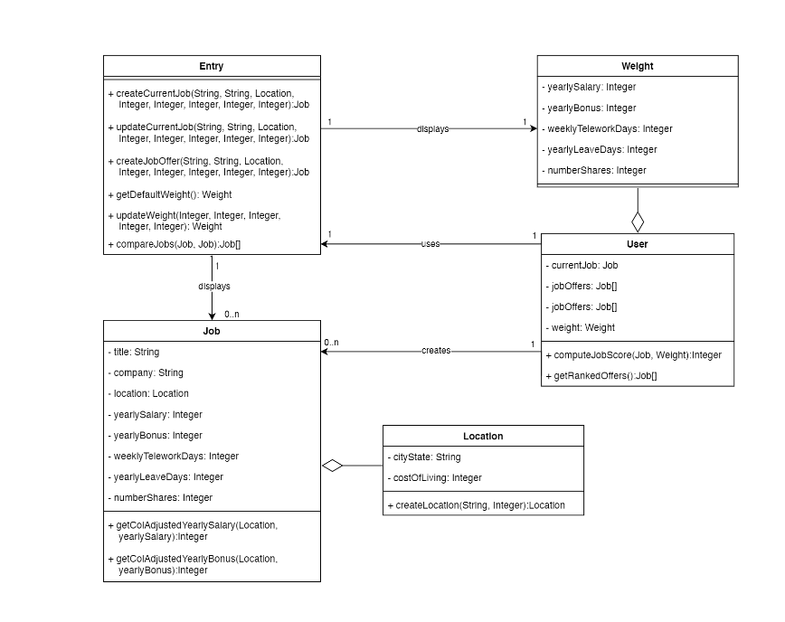
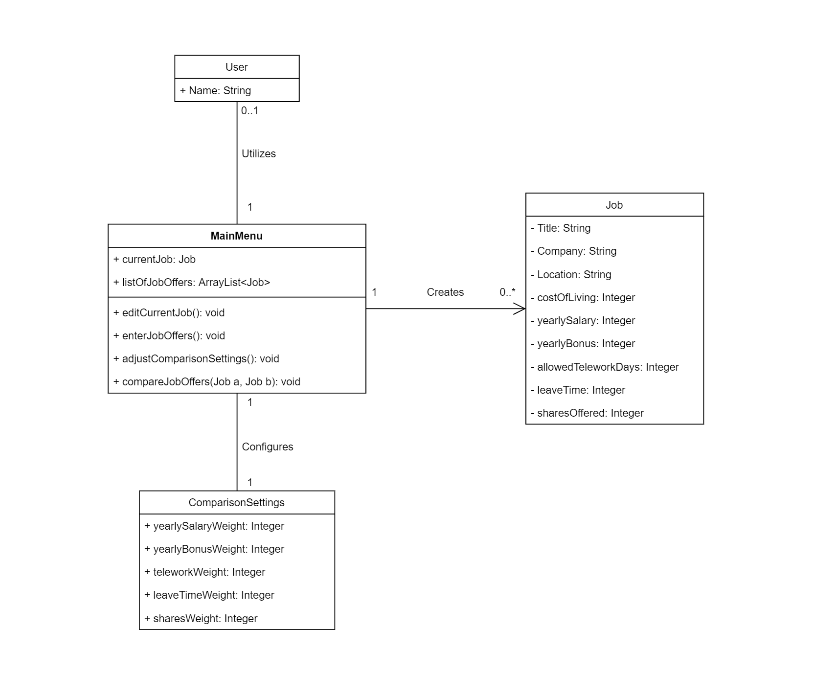

# Design Discussion

## Design 1 (lchen609)

- Pros
  - Simple design which tries to achieve all the requirements laid out
- Cons
  - Relationships between classes could have arrows to be more explicit in the relationship direction.
  - Parameters should be present in CompareJobs() to take in job classes.
  - May not need a user class in a single-user application
  - Attributes may need to be introduced in Main Menu class or somewhere else to store current job and the list of job offers

## Design 2 (rsaeidpo3)

- Pros
  - Very detailed desing which encompasesses the requirements of the project
  - Designed well to be modular 
- Cons
  - Current jbo and Job offer class share many of the same attributes. May be good to have a more generic job class.
  - Arrows to relationships would help understand direction
  - A calculate job score class may not be needed as the operation logic could reside in a method itself

## Design 3 (wqian40)

- Pros
  - Very detailed design with correct attributes, operations, classes, and relationships shown
- Cons
  - Entry class may be too ambiguous. Instead having a main menu class may be more benefifical
  - May not need a user class as the application would only be used by one user
  - Having a seperate class for location may be unnecessary as the attribute can be put into the job class itself.
  - No clear way to store the user's current job seperately from the job offers 

## Design 4 (kwong93)

- Pros
  - Simple design that encompasses the project scope
  - Having main menu class as entry point to handle user actions well laid out
- Cons
  - A user class is not needed in a single-user app
  - Adding what parameters the operations in the Main Menu class take in would help make design more clearer
  - Relationship between classes need direction
# Team Design

Commonalities that were found between designs shared by the team were that classes were made for the main menu and job offers. Through the main menu, it would be where the use could create new job offers, update their current job, update the comparison weight and compare jobs. Each of the proposed desings also had a job class that contaiend the required attributes of what was required of a job. Some difference found during discussion were that some desings had use of a User class. This was deemed unnecessary since the application wouyld be a single-user app so there wouldn't be situations where there were multiple users. This was then reflected in the final design. Other differences included classes that represented functionality of the application itself. In the aim of keeping the desing simple and clean, the extraneous classes were removed and it was decided that the implementation would reside in the Main Menu class where the logic would be in the method codebase itself. Overall, most of the interaction will be handled by the Main Menu class where the user will spend most of their time interacting with. A generic job class was made to handle both the current job and job offers. Lastly, a comparison settings was declared so that the settings would be stored and the desired attributes could be updated anytime. Instead of havihng comparison settings inside the Main Menu class, it would be seprate to keep the Main Menu class from being monolithic.

# Summary

Through discussion and collaboration within the team, many perspectives were shared in aims of improving the design of the application. Lessons that can be learned from the experience are the many different approaches possible when designing a system. Each design contributed has its own pros and cons. As a team, the final design chosen was one every member was satisfied with and was one that we believe would serve as the best option in serving as a basis for the application. Through the different backgrounds and experiences of each of us, we are able to support each other as a team and work together as a unit to reach our goals.
