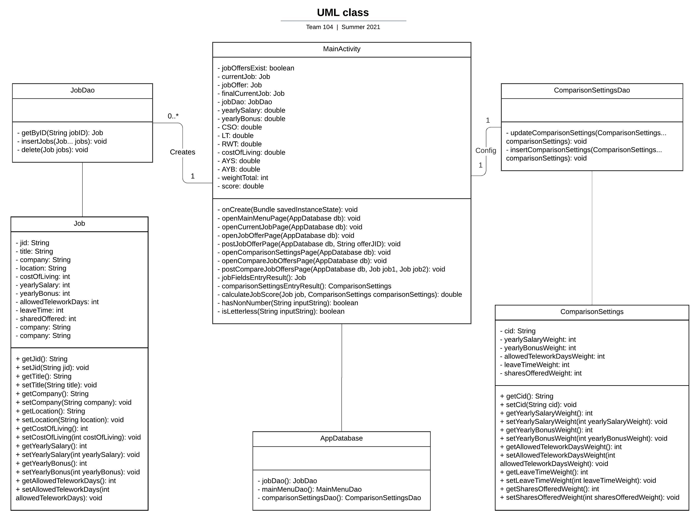

# Design Document

**Author**: Team 104

## 1 Design Considerations

### 1.1 Assumptions
- The system only has one user. 
- There is no need to implement authentication or authorization for the one user that is accessing this system.
- Application state should persist between runs. This can be accomplished by leveraging Android SQLite (recommended) or any other technology (including plain files).

These assumptions are important because they reduce the need for nonfunctional requirements
such as scalability, security, and reliability. 

### 1.2 Constraints
- The system must use Android 9.0 (Pie) with the API level 28.
- The amount of time to build this system is limited by the duration of this group project.

### 1.3 System Environment
The system must be operated on Android 9.0 (Pie) with the API level 28. With this software,
the system can be run on a hardware device with this operating system.

## 2 Architectural Design

### 2.1 Component Diagram
This is a simple system, so a Component Diagram is unnecessary. In the following sections, a Use Case Diagram is provided to illustrate user interaction with the system, a Class Diagram is provided to show structure of the system, and a Sequence Diagram is provided to show the object interactions, which we believe together provide a clear and comprehensive understanding of our system.  

### 2.2 Deployment Diagram
This is a simple system, so a diagram is unnecessary. During development, this program gets built and then gets deployed to actual hardware devices
by setting up an [Android Debug Bridge (ADB) connection](https://developer.android.com/studio/run/device) through either 
connecting to the device with a USB or connecting to the device using Wi-Fi.

## 3 Low-Level Design

### 3.1 Class Diagram

### 3.2 Use Case Diagram

### 3.3 Sequence Diagrams

Sequence Diagram for "onCreate":

Sequence Diagram for "openMainMenuPage":

Sequence Diagram for "openCurrentJobPage":

Sequence Diagram for "openJobOfferPage":

Sequence Diagram for "postJobOfferPage":

Sequence Diagram for "openComparisonSettingsPage":

Sequence Diagram for "openCompareJobOffersPage":

Sequence Diagram for "postcompareJobOffersPage":

## 4 User Interface Design

- One screen that shows the main menu and buttons that allows the user to take corresponding actions
  - Editing their current job
  - Entering job offers
  - Adjusting job comparison settings
  - Comparing job offers

- The editing current job button brings the user to a screen with job attributes fields available for
the user to fill out. This screen will also have a submit button to save the job details. When the user
  submits the job details, the user will be brought back to the main screen, and the screen will also have a back
  button to bring the user back to the main menu as well.

- The entering job offers button brings the user to a screen similar to the
editing current job screen, but for job offers.

- The adjusting job comparison settings button brings the user to a screen with
comparison settings fields to adjust attribute weights if a user wants to more heavily
  weight certain settings. This screen will contain a submit button which will set the comparison
  weights and bring the user back to the main menu. This screen will also have a back button
  to send the user back to the main menu as well. 

- The compare job offers screen brings the user to a screen with a ranked list of job offers
based off of their comparison settings. Within this screen, the user will have the option to compare
  two specific jobs against each other to view attribute details by choosing two jobs to compare
  and submitting a button to compare the two. Both of these screens will have a back
  button that will bring the user back to the main menu. (UI Picture will be added)