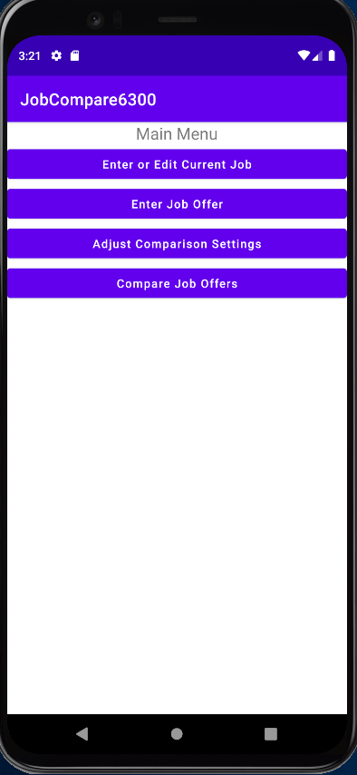
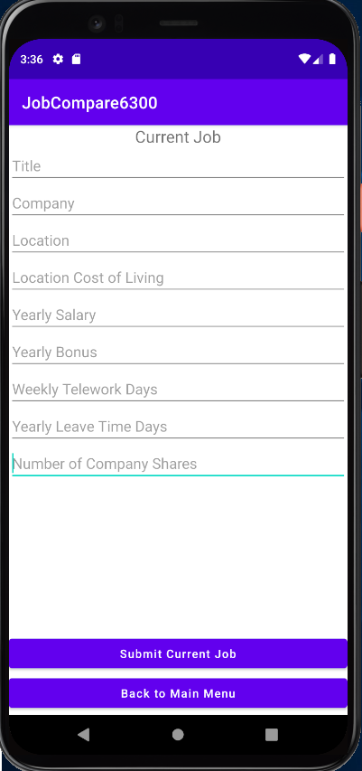
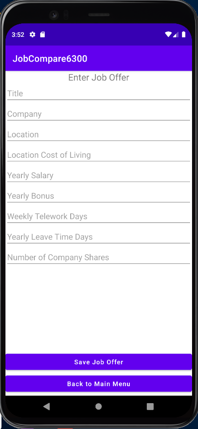
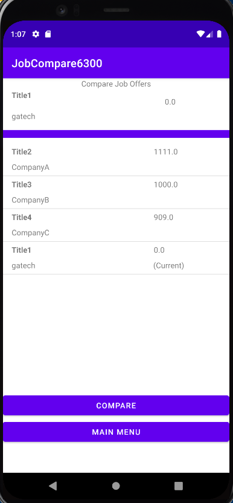
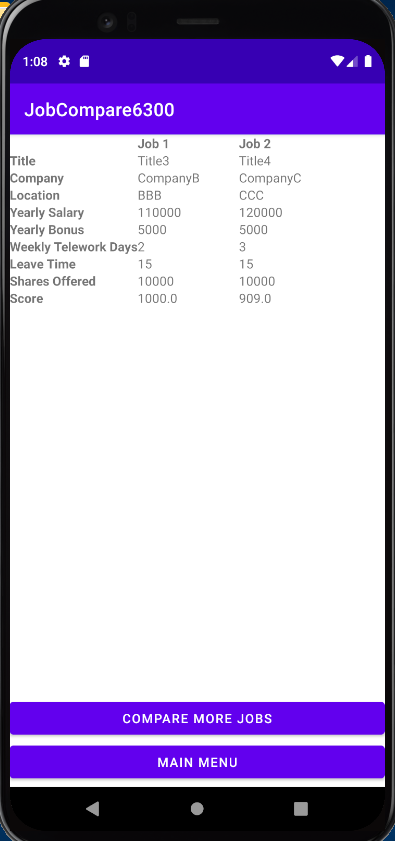

# JobCompare6300

This Android app is intended to be used by job seekers and allows the user to enter information of job offers easily. This app also has the ability to compare job offers with benefits, in different locations, and other aspects beyond salary. 

## 2. Start app

When the app is opened, you will be presented with the main menu which has the following four options, and each button will take to the designated page:
- 1. Enter or edit current job details  
- 2. Enter job offers
- 3. Adjust the comparison settings  
- 4. Compare job offers

## 3. Enter or edit current job details 

When the "Enter or Edit Current Job" button is clicked, you will be presented with the following form which allows you to add and modify the current job details. 

### 3.1 Add job details

If you haven't enter your current job details, you can choose to type in the following infomation:
- Title
- Company
- Location (entered as city and state)
- Cost of living in the location (expressed as an index)
- Yearly salary
- Yearly bonus
- Allowed weekly telework days (expressed as the number of days per week allowed for remote work, inclusively between 0 and 5)
- Leave time (vacation days and holiday and/or sick leave, as a single overall number of days)
Number of company shares offered at hiring (valued at $1 per share and expressed as a number >= 0)

Once it is done, click on the "Submit Current Job" button to save your information and go back to the main menu. Or click on "Back to Main Menu" to leave without save.

### 3.2 Edit job details
If you already entered your current job before, you can still choose to modify the current job information. After updating the required information, chose either "Submit Current Job" and "Back to Main Menu" botton and it will return to the main menu. 

## 4. Enter job offers
When the "Enter Job Offer" button is clicked, you will be presented with a similiar form which allows you to enter job offer details.

After entering the job offer details, you can choose to click on "Save Job Offer" to add this job offer to the database or click on "Back to Main Menu" to leave without saving.

After clicking on "Save Job Offer", you will be given the choice to "Enter Another Offer", "Back to Main Menu", and "Compare". The compare option allows you to compare your current job and the job offer you just entered.

## 5. Adjust the comparison settings
This app also allows to adjust weights of different aspect of jobs. After clicking on the "Adjust the comparison settings" button, the app will take you to a page which allows you to assign integer weights the following factor: 
- Yearly salary
- Yearly bonus
- Allowed weekly telework days
- Leave time
- Shares offered

A pesonalized comparison score will be generated. Please note all the weight are equal by default.  

## 6. Compare job offers 
To compare jobs, hit the "Compare job offers" botton from the main page. The user will see a list of job offers with the below information of Title and Company which has been ranked from best to worst job scores. After choosing two jobs and click the "Compare" button, a comparison table will be generated showing a side-by-side table that contains the following information:

- Title
- Company
- Location
- Yearly salary adjusted for cost of living
- Yearly bonus adjusted for cost of living
- Allowed weekly telework days
- Leave time
- Number of shares offered

You can choose to do another comparison by clicking on the "Compare More Jobs" button, which will take you back to the previous page. You can also choose to go back to the main menu by clicking on the "Main Menu" button.  

